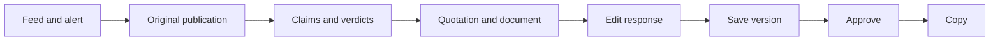

# DESIGN.md — Reputation Threat Monitoring Workspace

**Version:** 1.0 · October 2, 2026.  
**Purpose:** a shared UI/UX specification for two frontend developers at a hackathon.  
**Related document:** [MVP plan](defence-reputation-mvp-plan.md).  
**Deliverable:** design direction, tokens, screen structure, and interaction rules. The interface has not yet been implemented.

The product name has not been selected. It comes from configuration; this document does not select one of the proposed names. The MVP interface language remains Russian, with English technical keys. UI labels in this English edition are translated reference copy; localize them into Russian for the MVP.

## Contents

1. [Design Direction and References](#1-design-direction-and-references)
2. [Scope and Application Structure](#2-scope-and-application-structure)
3. [Visual System](#3-visual-system)
4. [Layout and Responsiveness](#4-layout-and-responsiveness)
5. [Incident Feed](#5-incident-feed)
6. [Incident Detail](#6-incident-detail)
7. [Documents, Settings, and Login](#7-documents-settings-and-login)
8. [Components and States](#8-components-and-states)
9. [User Flows](#9-user-flows)
10. [Copy and Data Presentation](#10-copy-and-data-presentation)
11. [Accessibility and Motion](#11-accessibility-and-motion)
12. [Implementation and Ownership](#12-implementation-and-ownership)
13. [Interface Acceptance Review](#13-interface-acceptance-review)

## 1. Design Direction and References

### 1.1. Core Idea

A calm workspace for an analyst: a light reading area, graphite navigation, a compact incident feed, and evidence alongside a response draft. The visual hierarchy supports **notice → understand → verify → respond**.

The primary user works with text and documents, makes decisions about incidents, and needs to distinguish priority, verification results, and their own decision quickly. The main screen presents a live work queue; the key product moment is a verifiable response to a selected publication.

Shared typography, colors, dimensions, components, and interaction rules establish a consistent style. Take useful patterns from each reference and apply them within this system.

### 1.2. How the Nine References Fit Together

| Reference | Pattern to Borrow | Application | Priority |
|---|---|---|---|
| [Linear](https://linear.app/docs/triage) | Intake queue, compact statuses, quick decisions | Feed and navigation between new and handled incidents | P0 |
| [Sentry](https://docs.sentry.io/product/issues/issue-details/?promo_name=hp-banner) | Incident summary, details, and context | Threat title, priority rationale, publication, and evidence | P0 |
| [Feedly Threat Intelligence](https://docs.feedly.com/article/739-ai-feeds-for-threat-intelligence) | Topic feeds, source configuration, filtering | Source settings, publication origin, and risk topics | P0; additional sources P1 |
| [Brand24](https://help.brand24.com/en/articles/9772539-mentions-tab-overview) | Mention with timestamp, source, and link | Publication presentation in the feed and detail screen | P0 |
| [incident.io](https://incident.io/changelog/tell-the-full-story-with-your-incident-timeline) | Readable chronology of key events | Compact history of ingestion, incident creation, draft readiness, and approval | P0 using existing timestamps; full history P1 |
| [Intercom Inbox](https://www.intercom.com/help/en/articles/7911926-customize-the-inbox-to-suit-you-and-how-you-work-best) | Workspace with multiple panels | Publication, claim verification, and response editor side by side | P0; user-adjustable panel layout P1 |
| [Gemini Notebook / NotebookLM](https://support.google.com/gemininotebook/answer/16179559?hl=en) | Citation with context and navigation to the source | Evidence review without losing the selected incident | P0; highlighting in a PDF viewer P1 |
| [Attio](https://attio.com/help/reference/managing-your-data/views/filter-and-sort-views) | Table views, filters, sorting | Quick filters: “New,” “High priority,” and “Approved” | P0; custom saved views P1 |
| [Grafana](https://grafana.com/docs/grafana/latest/visualizations/dashboards/use-dashboards/) | State overview, metrics, temporal context | Metric strip and source health | P0; charts and date ranges P1 |

### 1.3. Four Hierarchy Rules

1. **Publication → claim → evidence → response.** The interface preserves the relationship between these objects.
2. **Priority is separate from verification.** A high-priority incident may involve a supported problem or insufficient evidence.
3. **The AI response is a working document.** The editor clearly shows text provenance, save status, and the approved version.
4. **Readability comes before decoration.** Simple surfaces, typography, and dividers support sustained work with text.

## 2. Scope and Application Structure

### 2.1. P0 Screens

| Route | Navigation Label / Title | Primary Action |
|---|---|---|
| `/login` | Login | Sign in to the prepared account |
| `/app/incidents` | Incidents | Open a new incident |
| `/app/incidents/:id` | Incident details | Review evidence and approve a response |
| `/app/documents` | Documents | Upload a file and check processing |
| `/app/settings` | Settings | Update the profile / enable the source |

The sidebar has three items: “Incidents,” “Documents,” and “Settings.” Incident details belong to “Incidents.” Publications that do not create an incident do not need a separate screen in P0.

The demo panel opens from the feed toolbar only when server-side demo mode is enabled. It uses the existing endpoint and is not an additional top-level section.

### 2.2. P0 / P1 Boundary

P0 follows the existing plan's contract: one source, one organization, three counters, fixed filters, explicit text saving, approval, and dismissal.

P1 includes trend charts, date filtering with backend support, custom saved views, adjustable panel widths, an embedded PDF viewer, full revision history, regeneration, and export. These features do not appear as working buttons in the two-day MVP.

## 3. Visual System

### 3.1. Color Composition

The default theme is light. The sidebar is graphite; working surfaces are white on a cool, light-gray canvas. The single brand accent is dark teal. Blue, amber, red, and green convey state semantics.

A full dark theme is P1. It requires a separate review of document readability and semantic colors.

| Token | Value | Usage |
|---|---|---|
| `canvas` | `#F7F9FA` | Main workspace background |
| `surface` | `#FFFFFF` | Table, evidence, editor, forms |
| `surface-subtle` | `#F1F5F9` | Secondary background and neutral badges |
| `sidebar` | `#0F172A` | Navigation |
| `sidebar-active` | `#1E293B` | Selected navigation item |
| `sidebar-text` | `#F8FAFC` | Primary navigation text |
| `sidebar-muted` | `#94A3B8` | Secondary navigation labels |
| `sidebar-accent` | `#5EEAD4` | Light teal active indicator on graphite |
| `text` | `#0F172A` | Headings and body text |
| `text-secondary` | `#475569` | Descriptions, metadata, explanations |
| `text-muted` | `#64748B` | Low-emphasis labels on approved backgrounds |
| `border` | `#E2E8F0` | Section and row dividers |
| `control-border` | `#64748B` | Visible boundary of inputs and secondary buttons |
| `accent` | `#0F766E` | Primary actions and focus ring |
| `accent-hover` | `#115E59` | Primary button hover |
| `selected` | `#EEF6F5` | Selected row / active quick filter |
| `danger-text` / `danger-bg` | `#B42318` / `#FEF3F2` | High priority and errors |
| `warning-text` / `warning-bg` | `#92400E` / `#FFFBEB` | Medium priority and insufficient evidence |
| `info-text` / `info-bg` | `#1D4ED8` / `#EFF6FF` | Processing and contradictory evidence |
| `success-text` / `success-bg` | `#166534` / `#F0FDF4` | Approval and healthy service state |

Use `border` for grouping. A boundary needed to identify an interactive field uses the higher-contrast `control-border`. Apply text colors without additional opacity.

### 3.2. Badge Semantics

| Entity | State | Color | Additional Cue |
|---|---|---|---|
| Priority | High | Danger | Warning icon + “High” |
| Priority | Medium | Warning | “Medium” |
| Priority | Low | Neutral | “Low” |
| Verification | Supported by documents | Neutral | Check + explicit text label |
| Verification | Contradicted by documents | Info | Comparison icon + text label |
| Verification | Insufficient evidence | Warning | Question + text label |
| Verification | Opinion / assessment | Neutral | Speech + text label |
| Review | Needs review | Neutral | Outline indicator |
| Review | Approved | Success | Check + version and time |
| Review | Dismissed | Neutral | Archive + reason |
| Document | Processed | Teal text `#115E59` on `#F0FDFA` | File/check |
| Source | Demo feed | Neutral outline | Flask + “Demo” |

A supported negative claim receives a neutral verification label: support means agreement with the documents, not good news. Color is never the only way to communicate meaning.

### 3.3. Typography

Use **IBM Plex Sans** as the primary typeface. Use **IBM Plex Mono** for short identifiers and technical numbers. IBM Plex Sans supports Cyrillic; the family is designed for UI use among other applications. [Official IBM Plex repository](https://github.com/IBM/plex).

Load only the required weights, including Cyrillic, with `font-display: swap`. Fallback: system sans-serif; monospace for technical fields. Document and response body text remain sans-serif.

| Role | Size / Line Height | Weight |
|---|---|---|
| Page title | 24 / 32 px | 600 |
| Panel heading | 18 / 26 px | 600 |
| Incident row title | 14 / 20 px | 500 |
| Interface and forms | 14 / 20 px | 400 |
| Publication, quotation, response | 15 / 24 px | 400 |
| Metadata and badge | 12 / 18 px | 400–500 |
| Metric strip value | 24 / 30 px | 600 |
| Technical ID | 12 / 18 px, mono | 400 |

Enable tabular numerals for numbers. Align headings to the left. Give long quotations a comfortable reading width; do not shrink the font to force them into the layout.

### 3.4. Dimensions, Shapes, and Surfaces

- Spacing scale: `4, 8, 12, 16, 20, 24, 32, 40, 48 px`.
- Radius: `6 px` for controls, `8 px` for panels, `10 px` for dialogs, pill for badges.
- Desktop button/input height: `36 px`; compact row actions: at least `32 px`.
- Mobile controls: at least `44 px` high; spacing between separate icon actions: `8 px`.
- Panel padding: `16 px`; desktop page padding: `24 px`.
- Shadows belong to popovers, menus, and dialogs. Borders separate the main working panels.
- The metric strip is one shared section with vertical dividers, without three large standalone cards.

### 3.5. Icons

Use one family: [Phosphor Icons](https://phosphoricons.com/), regular weight. Size: `16 px` in rows and badges, `20 px` in navigation, `24 px` in empty states.

Core roles: inbox, file, settings, warning, check, question, link, copy, archive, flask. Select available library glyphs and confirm their names against the installed version. Every standalone icon button has an accessible text name.

### 3.6. Base CSS Tokens

```css
:root {
  --canvas: #f7f9fa;
  --surface: #ffffff;
  --surface-subtle: #f1f5f9;
  --sidebar: #0f172a;
  --sidebar-active: #1e293b;
  --sidebar-text: #f8fafc;
  --sidebar-muted: #94a3b8;
  --sidebar-accent: #5eead4;
  --text: #0f172a;
  --text-secondary: #475569;
  --text-muted: #64748b;
  --border: #e2e8f0;
  --control-border: #64748b;
  --accent: #0f766e;
  --accent-hover: #115e59;
  --accent-foreground: #ffffff;
  --selected: #eef6f5;
  --danger-text: #b42318;
  --danger-bg: #fef3f2;
  --warning-text: #92400e;
  --warning-bg: #fffbeb;
  --info-text: #1d4ed8;
  --info-bg: #eff6ff;
  --success-text: #166534;
  --success-bg: #f0fdf4;
  --ready-text: #115e59;
  --ready-bg: #f0fdfa;
  --neutral-text: #334155;
  --radius-control: 6px;
  --radius-panel: 8px;
  --radius-dialog: 10px;
  --space-1: 4px;
  --space-2: 8px;
  --space-3: 12px;
  --space-4: 16px;
  --space-5: 20px;
  --space-6: 24px;
  --space-8: 32px;
  --space-10: 40px;
  --space-12: 48px;
  --font-ui: "IBM Plex Sans", system-ui, sans-serif;
  --font-mono: "IBM Plex Mono", monospace;
}
```

These values are shared across all pages and components. Map them to the semantic tokens of the chosen Tailwind/shadcn version. The CSS above is a specification, not a complete project configuration.

## 4. Layout and Responsiveness

### 4.1. App Shell

Use a `216 px` sidebar on large desktops. Product name and organization at the top; three navigation items below; account and sign-out at the bottom. The active item has a graphite background, light text, and a small teal indicator.

The workspace top bar is `56 px` high: breadcrumbs on the left, source health and update time on the right. In demo mode, always display “Demo · fictional organization” here.

The sidebar is fixed; the main region has `min-width: 0`. The page owns the primary scroll, rather than each column. Independent scrolling is allowed in the textarea and long popovers. Sticky elements must not obscure focusable controls.

### 4.2. Breakpoints

| Viewport Width | Navigation | Feed | Incident |
|---|---|---|---|
| ≥1440 px | 216 px sidebar | Full table | Three columns, 16 px gap |
| 1280–1439 px | 200 px sidebar | Full table, compact labels | Three columns with minimum-width constraints |
| 1024–1279 px | 64 px rail with labels on focus/hover | Hide secondary columns; move metadata beneath the title | Publication above, verification and response in two columns |
| 768–1023 px | Navigation drawer | Cards with essential fields | Publication, verification, and response in sequence |
| <768 px | Drawer, wrapping toolbar | Cards, 44 px controls | One column, actions beneath the editor |

Suggested desktop detail grid: `minmax(220px, .75fr) minmax(340px, 1.15fr) minmax(320px, 1fr)`. When space is limited, change the composition instead of reducing text size.

At 1440 px, approximately 1176 px remain after the sidebar and page padding; three panels fit without horizontal scrolling. On mobile, a document opens in a separate tab after a user click; the app preserves the selected incident.

## 5. Incident Feed

### 5.1. Composition

```text
┌────────────────┬────────────────────────────────────────────────────────────────────────┐
│ Product        │ Incidents                    RSS active · updated 1m ago               │
│ Aegis Works    ├────────────────────────────────────────────────────────────────────────┤
│                │ Incidents                                                  [Demo feed] │
│ Incidents      │ Needs review 8 | High priority 3 | Approved 12                         │
│ Documents      │ [All] [New] [High priority] [Approved]                                 │
│ Settings       │ Priority ▾   Review state ▾   Origin ▾                                 │
│                ├────────────────────────────────────────────────────────────────────────┤
│                │ Publication           Priority   Verification    Review                │
│                │ Halted deliveries     High       Ready           Needs review          │
│                │ Delivery delay        Medium     Ready           Approved              │
│                │ Certificate           High       Analyzing       Needs review          │
│ Account        │                                                            [Load more] │
└────────────────┴────────────────────────────────────────────────────────────────────────┘
```

The numbers illustrate the composition. In the implementation, counters come from the API; demonstration values never replace real data.

### 5.2. Summary and Filters

Metrics: “Needs review,” “High priority · open,” and “Approved.” A small “Across the organization” caption explains that filters do not change these totals.

Quick views are presets of existing filters: “All,” “New” (`unreviewed`), “High priority” (`high`), and “Approved” (`approved`). Complex saved queries are unnecessary. Store selected filters in the URL; returning from an incident restores the list and scroll position.

P0 sorting is newest first. Add a simple “Reset” button when filters are active. Free-text search and date ranges require separate API support and belong to P1.

### 5.3. Incident Row

Minimum height: `72 px`, expanding when the title wraps. Columns: publication / priority / verification / review. Source and time sit beneath the title; origin appears next to the source.

The title is a link, limited to two lines in the feed and fully visible on the detail page. A short description presents the main claim. The priority rationale can appear on focus/hover or be read in incident details.

For several claims with different verdicts, display “Mixed results · N claims.” While verification is running, display the processing stage. `ready` alone does not mean that all claims have been contradicted.

Clicking the title opens the incident. The entire row may have a hover treatment, but it must not contain conflicting nested buttons. Approved and dismissed rows remain readable. Response actions are available inside the incident.

### 5.4. Source Health

The compact `SourceHealth` displays activity and the most recent successful fetch. If disabled, show “Monitoring paused.” If enabled but no data has ever been fetched, show “Waiting for the first fetch.” On error, show “Source error,” an explanation, and a settings link.

For a healthy source with an empty feed, show “No new incidents.” No incidents and no successful data retrieval are different states.

### 5.5. New Data and Analytics

When a new incident arrives, update metrics and show a toast with a link. If the user is reading below the first row, preserve their scroll position and show “New incidents available · Show” above the table. Do not shift the row they are reading with an unexpected insertion.

After the user clicks, refresh the top of the list. P0 pagination uses “Load more” with `next_cursor`, without infinite scrolling.

A publication-count chart over time is P1. If added, use one small time-series chart with labeled axes, an accessible tooltip, and a shared date filter. Build it only from real data.

## 6. Incident Detail

### 6.1. Overall Composition

```text
← Incidents / selected incident
Claim that all June deliveries were halted
[High] [Needs review] [Demo]                          [Dismiss incident]
Reason: the publication affects customer trust.

┌────────────────────┬──────────────────────────────┬──────────────────────────┐
│ Publication        │ Claim verification           │ Response draft           │
│ Demo feed          │ Claim 1                      │ AI draft · version 1     │
│ Date and time      │ “Not a single delivery…”     │                          │
│                    │ Contradicted by documents    │ According to the         │
│ Original text      │ Explanation                  │ provided register…       │
│                    │                              │                          │
│ Original link      │ Quotation                    │ Analysis sources         │
│                    │ “40 of 50 completed…”        │ [Register · p. 3]        │
│                    │ Register · Jul 2 · p. 3      │                          │
│ Coverage           │ [Open document]              │ [Save] [Approve]         │
│ limitations        │                              │ [Copy]                   │
└────────────────────┴──────────────────────────────┴──────────────────────────┘
Received 12:00 · Incident created 12:00 · Draft ready 12:01
```

Demo data illustrates the screen structure. After integration, content and timestamps come from the API. On the detail screen, “Approve” becomes the primary action after saving; dismissal has secondary visual emphasis.

### 6.2. Top Summary

- A short title describes the specific claim or risk.
- Priority and review state use separate labels.
- The priority rationale is visible in one or two lines, without requiring hover.
- The demo-feed label is always visible when `origin=demo`.
- The analysis stage appears on a separate line until the result is ready.
- “Dismiss incident” opens a dialog with a reason field.

A prominent “reputation 72/100” score, attack probability, and confidence percentage are not part of the contract. The summary uses specific claims, statuses, and timestamps.

### 6.3. Publication Panel

Contents: source, publication time, title, available text, original link, and coverage limitations.

For `content_coverage=summary`, display “Analysis based on the available summary” above the text. For `url=null`, explain “Demo material: no external link.” If the time is unknown, display “Publication time not provided”; ingestion time remains a separate field.

Long text may have “Show full text” after the first few paragraphs. Make it clear that this expands text already received, rather than fetching a complete article from an external website.

### 6.4. Verification Panel

Each claim has a separate block with its number, text, verdict, explanation, and evidence. Separate blocks with dividers. Maximum: three blocks, as defined in the MVP plan.

Display a quotation as a text excerpt on `surface-subtle` with a thin left border. Below it: document name, document date, and page or page range. For TXT, show the excerpt number if supplied by the API; otherwise, label it “Text document.”

“Open document” requests a signed URL and opens the source after an explicit user action. A link-loading error appears within the evidence block, preserving the quotation and available analysis.

For `insufficient_evidence`, explain what is missing. If there is no evidence, show “No relevant excerpts found.” If excerpts exist but do not resolve the question, show them with an explanation of the limitations. A quotation does not automatically change the verdict.

For different results across claims, display “Results differ across claims” above the blocks. Do not assign a truth label to the entire publication based on one successful match.

### 6.5. Response Panel

Top row: “Response draft,” text provenance, version, and save status. Before the first edit: “AI draft.” After a saved user edit: “User revision.”

The main control is a textarea with a comfortable minimum height of approximately `280 px`, vertical resizing, and standard text selection. Formatting, automatic variants, and a chat around the response are outside P0.

Beneath the editor, show evidence used by the original analysis. After editing, those sources do not become proof for every new user-written sentence; retain the precise label “Sources used in the original analysis.”

| Editor State | Visible Content | Available Actions |
|---|---|---|
| Response still being prepared | “Preparing draft” placeholder and analysis stage | Read the publication and available evidence |
| Saved draft | Version, provenance, text | Edit, approve, copy |
| Local changes | “Unsaved changes” | Save, discard edits, copy local text |
| Saving | “Saving…,” stable button width | Continue reading; duplicate save is disabled |
| Save error | Inline message; local text retained in UI state | Retry saving or copy the text |
| Version conflict | “The draft has changed” | Copy edits; reload the server version |
| Approved | Author, time, approved version | Copy; enter editing mode |
| Dismissed | Dismissal reason and saved response, if any | Read and copy; editing is unavailable in P0 |

“Approve” is available when `processing_state=ready`, the draft is nonempty, there are no unsaved changes, and the incident is not dismissed. Explain a disabled action when the reason is unclear: “Save your changes first.”

After approval, the textarea becomes read-only. “Edit” enables local editing mode with the caption “Saving edits will require approval again.” Server-side approval is cleared after a new version is successfully saved. Until then, display “Version N is approved; current edits are not saved.”

“Copy” copies the displayed text. Local edits are not marked as approved. Confirm success briefly with “Copied”; if clipboard access fails, allow manual text selection.

### 6.6. History and Response Time

The lower section contains a compact timeline based on available data: material received (`ingested_at`), incident created (`created_at`), draft ready (`ready_at`), and version approved (`approved_at`). An event that has not occurred is shown as pending, without an invented timestamp.

Use the same timestamps to show actual “Time to incident” and “Time to draft” intervals. Intermediate retrieval/verification stages do not receive fabricated timestamps. A complete audit log with all actions is P1.

## 7. Documents, Settings, and Login

### 7.1. Documents

“Documents” heading and “Upload” button. A compact caption beneath: “Documents are used to verify claims and prepare responses.”

For an empty corpus, display the upload area directly on the page. When documents already exist, use a dialog with a file picker, drag-and-drop, and an optional document-date field. Accept PDFs with a text layer and TXT; display the limits defined in the MVP plan.

Table columns: file, document date, format, status, upload date, action. File names may wrap; document date and upload date remain separate columns. Display an unknown date as “Not provided.”

Statuses: “Queued,” “Processing,” “Processed,” “Error.” On error, show the reason and “Retry processing.” For a ready file, show “Open.” File deletion through the UI is P1.

Upload percentages are allowed only when transferred bytes are measured. After `202 Accepted`, show processing stages without an artificial indexing percentage. A failed file must not hide successfully uploaded files.

### 7.2. Settings

Two vertical sections on one page, with a form width of approximately `720 px`.

**Organization:** name, aliases, description, risk topics. In P0, aliases can be entered one per line in a textarea; no complex tag editor is needed. Risk topics are clear checkbox options from the available configuration. “Save profile” applies only to this section.

**Source:** name, preconfigured URL, activity toggle, most recent successful fetch, latest error. The URL is read-only in P0. Show pending while saving the toggle; on error, restore the previous state and explain why.

“Monitoring ready” means that the profile is configured, at least one document is ready, and the source is enabled. If the corpus is not ready, display “Detection is available; document-based verification is limited” and an “Upload documents” link.

### 7.3. Login

A compact form approximately `360 px` wide, centered on the light canvas: product name, email, password, “Sign in.” Support password managers and correct autocomplete attributes.

Display login errors inline without clearing the email. Disable duplicate submission while pending. Registration and password recovery UI are outside P0. After login, open the feed; profile preparation is accessible through a clear prompt.

### 7.4. Demo Panel

“Demo feed” opens a small dialog with three built-in scenarios: delivery claims contradicted by documents, supported delays, and insufficient evidence about a certificate. Clearly state here that the company and materials are fictional.

After submission, show “Material added. Waiting for an incident” and retain `run_id` for network retries. When the corresponding `mention_id` appears in the feed, make an “Open incident” link available.

Do not present a long wait as a confirmed model failure unless the API reports one. Show “Processing continues” and let the user close the dialog / open the feed. Closing the dialog does not cancel server-side processing. A new run after completion receives a new `run_id`.

## 8. Components and States

### 8.1. Minimum Component Set

| Component | Responsibility | States |
|---|---|---|
| `AppShell` | Navigation, organization, demo label, header | Desktop, rail, mobile drawer |
| `SourceHealth` | Activity and latest fetch | Healthy, paused, waiting, error |
| `MetricStrip` | Three counters and their scope | Loading, ready, unavailable |
| `IncidentFilters` | Presets and fixed filters | Default, filtered, reset |
| `IncidentRow` / `IncidentCard` | Scannable feed entry | Pending, ready, failed, approved, dismissed |
| `SeverityBadge` | Priority only | High, medium, low |
| `VerdictBadge` | Verification result only | Supported, contradicted, insufficient, opinion |
| `ReviewBadge` | User decision | Unreviewed, approved, dismissed |
| `ProcessingStatus` | Actual processing stage | Queued, retrieving, verifying, drafting, ready, failed |
| `PublicationPanel` | Available text and origin | Full, summary, no external link |
| `ClaimBlock` | Claim, verdict, rationale, evidence | Loading, evidence, insufficient, opinion |
| `EvidenceBlock` | Quotation and document metadata | Available, opening, link error |
| `DraftEditor` | Local text and version | Loading, clean, dirty, saving, conflict, approved, dismissed |
| `IncidentTimeline` | Actual events | Completed / expected events |
| `DocumentUpload` | File and date | Idle, uploading, accepted, error |
| `EmptyState` / `InlineNotice` | Clear next action | Empty, warning, error, limitation |

Do not rename backend enums. Components share a mapping from technical values to localized labels and colors. UI-only states such as `dirty/saving/conflict` are not stored as incident statuses.

### 8.2. Loading States

On initial feed loading, show a skeleton for the metric strip and several rows matching the final geometry. Refetching must not replace a readable list with skeletons.

While analysis is being prepared, the original publication is already visible. The verification panel shows “Finding documents” or “Verifying and preparing response.” The editor is not yet available. Skeletons must not imply that missing evidence has already been found.

Loading a signed URL shows a local pending state on the button, without blocking the entire page.

### 8.3. Empty and Error States

| Situation | Heading / Message | Action |
|---|---|---|
| No incidents with a healthy source | “No new incidents” | Source health and most recent fetch |
| Filters match nothing | “No incidents match these filters” | “Reset filters” |
| Monitoring disabled | “Monitoring paused” | “Configure source” |
| No ready documents | “Document library is not ready” | “Upload documents” |
| No evidence | “Insufficient evidence for verification” | Explain which information is missing |
| AI error | “Analysis could not be completed” | “Retry analysis” after server-side `failed` |
| Feed error | “Could not load incidents” | “Retry”; preserve existing data, if available |
| Draft conflict | “The draft has changed” | Copy local edits and reload the version |
| Source unavailable | “Source error” | Most recent success and settings link |

Use toasts for brief confirmations and new incidents. Errors requiring a decision stay inline until resolved. A new-incident notification has “Open” and a close button; missing the toast does not remove the incident from the feed.

## 9. User Flows

### 9.1. Primary Flow



The user opens an incident as soon as it is created. The publication stays in place while the other panels fill as results arrive. The main content layout preserves dimensions so that text does not jump between stages.

### 9.2. Reviewing the Source

Click evidence → obtain a signed URL → open the document. The original tab preserves the incident, selected claim, and local edits. P0 does not require custom PDF highlighting; the user compares the displayed quotation and metadata with the source.

### 9.3. Saving and Approval

The user edits text → editor becomes `dirty` → “Save” with `expected_version` → new server version → “Approve” with the current version → author, timestamp, and version displayed.

Approval means agreeing on text inside the product. The action label and confirmation do not promise external publication: “Response approved. You can copy it.”

When navigating away with unsaved edits, offer to stay or leave without saving; use the browser's standard warning when leaving the browser page. On receiving a newer server version, preserve local text and explain the conflict.

### 9.4. Dismissing an Incident

“Dismiss incident” → short reason → save → `dismissed`. The publication, analysis results, and previously saved text remain available. Save or explicitly discard unsaved local edits before dismissal.

### 9.5. Insufficient Evidence and a Supported Problem

Both scenarios use the same layout. When evidence is insufficient, the evidence panel explains the limitation and the draft proposes verification. For a supported problem, the response acknowledges the factual part. Neither scenario is disguised behind a green “Everything is safe” label.

## 10. Copy and Data Presentation

### 10.1. Label Dictionary

| Technical Value | Label |
|---|---|
| `high / medium / low` | High / Medium / Low |
| `unreviewed` | Needs review |
| `approved` | Approved |
| `dismissed` | Dismissed |
| `queued` | Queued |
| `retrieving` | Finding documents |
| `verifying` | Verifying claims |
| `drafting` | Preparing response |
| `ready` | Analysis ready |
| `failed` | Analysis could not be completed |
| `supported_by_documents` | Supported by documents |
| `contradicted_by_documents` | Contradicted by documents |
| `insufficient_evidence` | Insufficient evidence |
| `opinion` | Opinion / assessment |
| `origin=demo` | Demo feed |
| `origin=live` | Live source |

For documents, label `ready` as “Processed” and `failed` as “Processing error.” Shared enum values do not force different entities to use identical copy.

### 10.2. Microcopy

- Instead of “Counter-narrative generated”: “Response draft ready.”
- After saving: “Changes saved · version N.”
- After approval: “Version N approved.”
- For insufficient evidence: “The uploaded documents do not contain enough information to verify this claim.”
- For limited text: “The publication title and available summary were analyzed.”
- Dates: “Document date,” “Published,” “Received,” and “Approved” represent different values.
- Corpus limitation: “This assessment is based on the documents provided.”

### 10.3. Data and Formatting

Use relative time in the feed; show exact dates and times in incident details and accessible tooltips. Use the browser's local time; the full label may include the time zone. A document date without a time must not undergo time-zone conversion.

Zero is a valid value. Show unknown data as “Not provided” / “Unavailable,” not zero. Calculate durations only from available, valid timestamps.

A short display ID may be derived from the UUID; it is a label, while the API uses the full ID. Do not imply sequential numbering that the backend does not create. Obtain evidence, ready-document, and incident counts from the appropriate data source.

## 11. Accessibility and Motion

### 11.1. Accessibility

Target a minimum contrast ratio of `4.5:1` for normal text and `3:1` for large text. [WCAG: Contrast Minimum](https://www.w3.org/WAI/WCAG22/Understanding/contrast-minimum.html).

Relative luminance was calculated for the selected primary pairs:

| Pair | Contrast |
|---|---:|
| White text / primary teal button | 5.47:1 |
| Secondary text / white surface | 7.58:1 |
| Muted text / white surface | 4.76:1 |
| Muted text / canvas | 4.51:1 |
| Secondary sidebar text / sidebar | 6.96:1 |
| Danger text / danger background | 6.05:1 |
| Warning text / warning background | 6.84:1 |
| Info text / info background | 6.16:1 |
| Success text / success background | 6.81:1 |

This verifies the specified tokens, not the interface that has yet to be built. Changing a color, opacity, background, or size requires another check in the implementation.

All actions are keyboard-accessible. Use a `2 px` focus ring with a `2 px` offset. Controls have visible labels. Toasts do not steal focus; useful updates may be announced through `aria-live=polite`.

Dialogs return focus to their trigger, support Escape, and trap focus correctly. Tooltips with important explanations are also available on focus; essential information is visible on screen.

Aim for hit areas of at least `32×32 px` on desktop and `44×44 px` on mobile. WCAG 2.2 AA's minimum target size is `24×24 CSS px`, with specified exceptions; this project's targets exceed that minimum. [Target Size Minimum](https://www.w3.org/WAI/WCAG22/Understanding/target-size-minimum.html).

At 200% zoom, the layout reflows and buttons and long labels do not overlap. The table becomes cards; documents and the textarea support normal scaling.

### 11.2. Motion

- Hover/focus: `120 ms`; popover/dialog opening: approximately `160 ms`.
- State changes: brief text appearance without moving large blocks.
- Processing is indicated by its actual stage label. Skeletons are used only where content is expected.
- For `prefers-reduced-motion`, disable shimmer and position transitions.
- Pulsing threats, blinking indicators, and decorative radar animations are unnecessary in the workspace.

CSS transitions are sufficient for P0; a separate animation library is not an MVP dependency.

## 12. Implementation and Ownership

### 12.1. Foundation

Use React + Vite + TypeScript, Tailwind, and shadcn/ui from the MVP plan. Use one set of primitives and one icon family. Connect tokens at the theme level; components use semantic roles.

TanStack Query handles server data. Keep local editor state separate from the query cache: `serverText`, `localText`, `serverVersion`, `isDirty`, `saveState`. Loading a new server snapshot does not overwrite `localText` when `isDirty=true`.

Realtime events trigger another GET. Initial data loads through the API; server state is reconciled after reconnecting. The UI supports the plan's fallback polling rather than assuming every event is delivered successfully.

Primitives: button, input, textarea, select, checkbox, switch, dialog, tooltip, popover, separator, table, and toast. Reuse an existing component where available. Add only necessary primitives, checking the project's existing dependencies.

### 12.2. Work Split Between Two Frontend Developers

| Frontend 1 | Frontend 2 |
|---|---|
| AppShell, login, shared tokens, common API client | Documents, ClaimBlock, EvidenceBlock |
| MetricStrip, filters, IncidentRow/Card | PublicationPanel and complete detail layout |
| SourceHealth, settings, demo dialog | DraftEditor, save/approve/conflict |
| Realtime, new incidents, pagination | Timeline from existing timestamps |
| Feed states and shell accessibility | Evidence/editor states and detail responsiveness |

Start by agreeing on tokens, enums, and three reference components: Button, Badge, Panel. Then each developer implements their vertical slice using shared JSON examples. This split matches the F1/F2 tasks in the main plan.

### 12.3. Implementation Order

1. Tokens, fonts, app shell, routing.
2. Feed and detail screens with demo data matching the API contract.
3. Documents, profile, source.
4. Real data, Realtime, processing stages.
5. Editing, saving, approval, conflicts.
6. Empty/error states and responsiveness.
7. Demo flow review and fixes.

By the end of day one, the primary flow works with real backend responses. The final four hours of day two are for fixes and rehearsal only. Do not revisit colors or layout after that deadline without a specific issue.

### 12.4. What to Cut When Behind Schedule

Cut all P1 features first, followed by secondary tooltips, expanded long-text disclosure, and detailed timeline presentation. If PDF is replaced by TXT, change the evidence label rather than the whole screen.

Always preserve: visible publication, correct verdict, access to the quotation/source, unsaved edits, version saving, human approval, error states, and explicit demo labeling.

## 13. Interface Acceptance Review

### 13.1. Reference States to Review

Prepare mock/API examples for: a new threat being processed; a ready response with contradictory documents; a supported problem; insufficient evidence; multiple verdicts within one publication; AI error; version conflict; approved response; dismissed incident; empty feed; source error; PDF error.

Review actual states rather than a single ideal screenshot.

### 13.2. Checklist

- [ ] The visual language is consistent across the feed, documents, settings, and detail screens.
- [ ] The sidebar contains only three P0 items; the product name comes from configuration.
- [ ] Counters and active filters have a clear scope.
- [ ] Priority, verdict, processing, and review are not combined into one badge.
- [ ] Different claims can have different results.
- [ ] The demo source and fictional organization are clearly labeled.
- [ ] A limited publication summary is not presented as full text.
- [ ] The quotation, document date, and actual page are readable and accessible.
- [ ] Approved text is tied to a saved version; saving new edits clears approval.
- [ ] Realtime does not erase input or shift a feed row the user is reading.
- [ ] The user can recover from API, AI, signed-URL, and save errors.
- [ ] SourceHealth explains a paused source, first-fetch waiting, and errors.
- [ ] The complete primary flow is keyboard-accessible.
- [ ] Contrast is checked in the combinations and states actually used.
- [ ] The layout has been reviewed at 1440, 1280, 1024, 768, and 390 px, and at 200% zoom.
- [ ] A reduced-motion fallback exists, and sticky elements do not obscure actions.
- [ ] P0 does not expose unimplemented chart, export, saved-view, or external-publication buttons.
- [ ] The “material → alert → document → response → approval” demo flow has been completed twice on the hosted version.

### 13.3. Outcome Criterion

In one pass, the user understands what was detected, why it needs attention, what the documents say, and which response version they are approving. All nine references support this task through a shared composition and consistent components.
