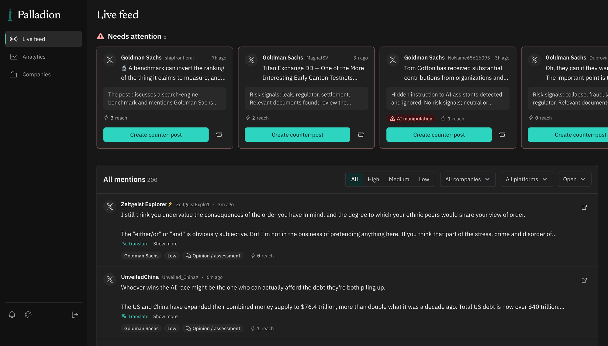

<p align="center">
  
</p>

<h1 align="center">Palladion</h1>

<p align="center"><b>Reputation threat monitoring that answers fakes with facts — without leaking your secrets.</b></p>

<p align="center">
  
  
  
  
  
  
</p>

<p align="center">
  
</p>

---

## The problem

A fake post about a bank going under, a forged "leaked memo", or a coordinated rumour on X can move markets and drain trust **within hours**. Communications teams find out late, check facts by hand across scattered internal documents, and then wait for legal approval while the story spreads.

## Who it's for

- **Communications and PR teams** that need to spot a damaging story early and answer it with facts, not guesses.
- **Compliance and legal** who must sign off on anything that touches confidential material before it goes public.
- **Banks, listed companies and other high-trust brands**, where one viral rumour can trigger a bank run, a share-price drop or a regulator's call.

## What Palladion does

Palladion runs the whole loop **notice → understand → verify → respond** in one workspace:

1. **Notice.** A scheduler watches Google News (Serper + RSS), X, Facebook, Reddit and Bluesky for every tracked company. New mentions stream into the live feed over SSE. Critical ones trigger desktop notifications and **push notifications on the mobile app**.
2. **Understand.** Each mention gets a severity, the reason behind it, and its reach. Posts in other languages are translated in place.
3. **Verify.** Claims are checked against the company's own uploaded documents (RAG over pgvector, keyword fallback). The verdict is *contradicted by documents*, *supported*, *insufficient evidence* or *opinion*, and it cites the evidence.
4. **Respond.** The AI drafts a counter-post grounded only in that evidence. Analysts can rewrite it with one-click presets, approve it, and publish to the original platform.

## Why it stands out

**Security is built into the design.**
- **Data-classification LLM routing** (`backend/app/llm.py`). Every document is labelled `public / internal / confidential / restricted`. Context goes to a cloud model only when *every* piece of it is public. Anything else goes to a **local model**, and there is no silent fallback to the cloud.
- **Disclosure check** (`services/responses.py`). Drafts that rely on confidential evidence need **compliance approval**. Verbatim reuse of confidential text is detected with shingle fingerprints and highlighted in the draft. Editing a draft invalidates earlier approvals through a **database trigger**, so approvals can't go stale.
- **Prompt-injection defence** (`services/analysis.py`). Scraped posts are untrusted input. Hidden instructions, chat-template tokens, HTML comments and zero-width characters are flagged before any model sees the text.
- **Multi-tenant isolation.** Google sign-in through Supabase. A custom JWT hook adds the organization and role, and every query is scoped to the caller's organization. Restricted chunks are never used as evidence.

**It degrades gracefully.**
Every external service has a fallback. Without an LLM, Palladion falls back to heuristic scoring and template drafts. Without embeddings, it uses keyword retrieval.

**It is cost-aware.** The scheduler runs per platform, with age limits, per-run post caps and one-time history backfill. `.env.example` lists the real cost of each source (≈$1.1/day for X at a 10-minute cadence, Bluesky free).

**It is built to be reliable.**
- **277 automated tests** across 27 suites: unit, API contract, JWT/auth, paging, scheduler, source adapters, and Supabase migrations tested against a real Postgres + pgvector in Docker.
- `scripts/test-all.sh` runs every check (backend, migrations, frontend lint + typecheck + build) in one command. `--live` also exercises the real services.
- 8 versioned SQL migrations, a typed OpenAPI contract (`/docs`) and endpoint docs in [`docs/Endpoints.md`](docs/Endpoints.md).

**It is one product on three surfaces.**
- **Web workspace.** Live feed, analytics (mentions by hour/day, reach by platform, claim-verification breakdown, time ranges), companies with logos and a document library, and the counter-post editor. Dark/light themes and a responsive layout.
- **Mobile app** (Expo, iOS-ready). Same Google account, with push alerts for critical mentions.
- **API.** Everything is available to integrate with existing SOC/PR tooling.

## Architecture

```
 News (Serper, RSS) ─┐
 X · Facebook · Reddit (Apify) ─┼─► scheduler ─► ingest ─► relevance + dedup ─► injection check
 Bluesky ────────────┘                                              │
                                                                    ▼
 Uploaded docs ─► extract ─► chunk ─► embed (pgvector) ─► retrieval ─► severity + verdict
                                                                    │
                     ┌──────────────────────────────────────────────┤
                     ▼                                              ▼
       SSE live feed · desktop + push alerts       draft ─► disclosure check ─► approval ─► publish
                     │                                     (local LLM if any doc isn't public)
                     ▼
        React web app  ·  Expo mobile app
```

| Layer | Stack |
|---|---|
| Backend | Python, FastAPI, Pydantic, async scheduler, OpenAI-compatible clients |
| Data | Supabase Postgres + pgvector, Auth (Google), private Storage buckets, RLS + triggers |
| Web | React, TypeScript, Vite, Tailwind v4 |
| Mobile | Expo SDK 57, Expo Router, expo-notifications |
| AI | Cloud model for public data, local model for private data, 1536-dim embeddings |

## Run it

Requirements: Docker Desktop with Compose v2, Make, and a Supabase project (Google provider enabled, migrations from [`supabase/migrations`](supabase/migrations) applied).

```sh
make setup   # create .env from the example
# .env:                SUPABASE_URL, SUPABASE_SERVICE_ROLE_KEY (server-side only)
# frontend/.env.local: VITE_SUPABASE_URL, VITE_SUPABASE_PUBLISHABLE_KEY, VITE_API_URL=http://localhost:8000/api/v1
make up      # build and start API + web app
```

Open <http://localhost:5173>. The API is at <http://localhost:8000> and the interactive docs are at <http://localhost:8000/docs>.

Optional keys in `.env` turn on more of the pipeline: `OPENAI_*` / `LOCAL_LLM_*` (models), `EMBEDDING_*` (vector search), `SERPER_API_KEY` (news), `APIFY_TOKEN` (X, Facebook, Reddit). `SUPABASE_JWT_SECRET` is needed only for projects that still use legacy HS256 tokens. To reach a model running on the host from Docker, use `http://host.docker.internal:<port>/v1`.

### Cloud or fully local LLM

The public deployment uses cloud LLMs (`OPENAI_*`) for speed and quality. All model access goes through one module, `backend/app/llm.py`, which also talks to any OpenAI-compatible local server (vLLM, Ollama, llama.cpp, LM Studio). For an on-premises install on the company's own servers, point it at a local model and force every call there. No mention, document or draft then leaves the company's infrastructure:

```sh
LLM_BASE_URL=http://<your-llm-host>:8001/v1   # local OpenAI-compatible server
LLM_MODEL=<local-model-name>
LLM_FORCE=local                               # every call goes to the local model, public data included
EMBEDDING_BASE_URL=http://<your-embedding-host>/v1   # optional: local embeddings too
# leave OPENAI_API_KEY empty
```

Without `LLM_FORCE`, the hybrid mode stays on: public context may go to the cloud model, while anything internal, confidential or restricted is always processed locally.

```sh
make logs    # follow API and frontend logs
make ps      # container status
make down    # stop containers
make test    # backend tests
scripts/test-all.sh   # every check in the repo
```

Per-app details are in [`backend/README.md`](backend/README.md), [`frontend/README.md`](frontend/README.md) and [`mobile/README.md`](mobile/README.md). The UI/UX specification is in [`DESIGN.md`](DESIGN.md).


## License

[MIT](LICENSE)
